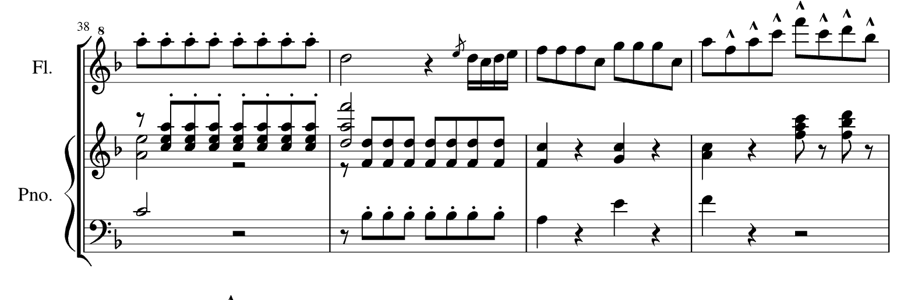
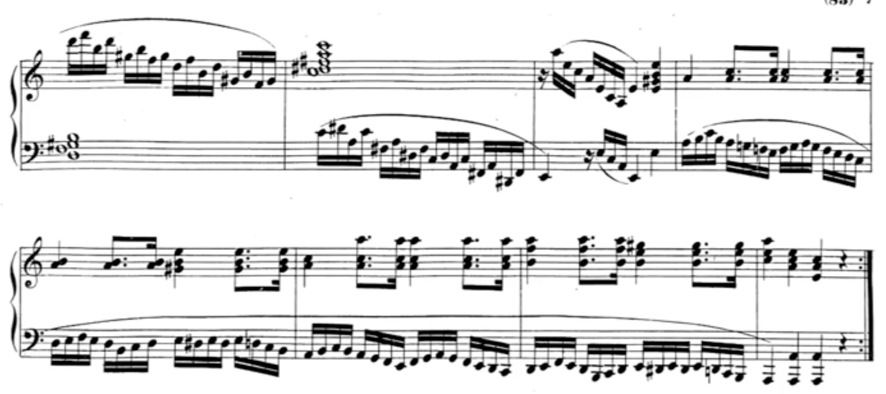
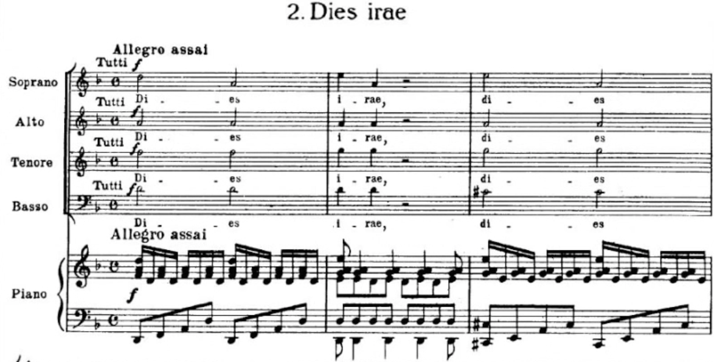

[category]: <> (General)
[date]: <> (2021/07/24)
[title]: <> (Symphonies and Scatology: Mozart At His Most Feral)

Wolfgang. Amadeus. Mozart. 

What a name. What a guy! Perhaps the greatest composer of all time, this immature little wretch is responsible for a veritable library of composition which (along with Johann Sebastian) forms nothing less than the canonical foundation of Western Music.

Despite living half as long as the majority of his contemporaries, Mozart was able to match, if not exceed their compositional output. In order to do this, Mozart had to work faster, and more efficiently than the average musical genius of the day. Because of this, while Mozart's music echoes with the ideals of *Stil Galant* - charmingly elegant, peaceful - there are a select few moments where things go utterly off the rails. Punctuating the perfection, there is an innate urgency - a glimpse into the mind of the tortured genius - a rushing, pulsing mania. A plea against early encroaching death. 

There is also a fun little piece called *Leck mich im Arsch*. I'm not going to translate that, but hopefully you can infer it's meaning, and hence infer the incredibly feral nature of Wolfgang himself.

**Number 5: Concerto for Piano and Orchestra (d-minor) K.466**

    

<!-- audio tag starts here -->
<audio controls>
    <source src="{{ url_for('static',filename='audio/test.mp3') }}" type="audio/mp3">
</audio>
<!-- audio tag ends here --> 

Beloved by the romantics, this tempest of a concerto alternates between lilting swathes of tone, and violent outburst of rage quicker than you can say *Nannerl*. This particular selection occurs moments before the cadenza, 

**Number 4: "Der Hölle Rache kocht in meinem Herzen" from Die Zauberflöte (The Magic Flute) K.620**

    

<!-- audio tag starts here -->
<audio controls>
    <source src="{{ url_for('static',filename='audio/test.mp3') }}" type="audio/mp3">
</audio>
<!-- audio tag ends here --> 

This famous piece details the vengeful oath of a deranged queen mother. I suppose the quaint title of "Hell's vengeance boils in my heart" does not imply butterflies and rainbows. Don't you love it when mom gives you a dagger and orders you to kill Sarastro and threats to disown you if you do not but Monostatos returns and tries to force your love by threatening to reveal the Queen's plot but before the he can enter the temple he is cast out into eternal night? 😍

**Number 3: Piano Sonata No. 8 in a-minor K.310**

    

<!-- audio tag starts here -->
<audio controls>
    <source src="{{ url_for('static',filename='audio/test.mp3') }}" type="audio/mp3">
</audio>
<!-- audio tag ends here --> 

Relatively unknown, this gem of a sonata really hits different. There's nothing quite like a resolute, pounding march, accompanied by frantic, descending semiquavers. We're definitely loosing the plot now.

**Number 2: **

    

<!-- audio tag starts here -->
<audio controls>
    <source src="{{ url_for('static',filename='audio/test.mp3') }}" type="audio/mp3">
</audio>
<!-- audio tag ends here --> 

**Number 1: The Requiem in D minor, K. 626**

This piece is essentially a garguantuan, beserk, fever-dream; it is without a doubt Mozart's most feral composition. Imagine it: one can all but feel the daggers of icy rain as one races through the sleeping streets of 16th-century Salzburg. Hacking into a bloody handkerchief, the vengeful spectre of one's deceased father haunting the mind, one frantically pens the final bars of an unfinished *Requiem*, knowing it will be the soundtrack to one's own funeral. 

I have included a few sections which really pop off, however, I might as well have included a pdf of the entire score. Yes, it is really that good. Go listen to it. Stop reading. Go. NOW!

    

<!-- audio tag starts here -->
<audio controls>
    <source src="{{ url_for('static',filename='audio/test.mp3') }}" type="audio/mp3">
</audio>
<!-- audio tag ends here --> 

One such example is this excerpt from the *Lacrimosa* ("weeping/tearful"). The high, pining intervals evoke a sense of hopelessness which only escalates throughout the piece. By the final, tremendous AAAAAAAAAAAAAAAAAAAA-MEEEEEEEEEENNN, we 

    

<!-- audio tag starts here -->
<audio controls>
    <source src="{{ url_for('static',filename='audio/test.mp3') }}" type="audio/mp3">
</audio>
<!-- audio tag ends here --> 

Literally *Day of Wrath*, this piece is not something you would play at your 4 year old's birthday party. 
