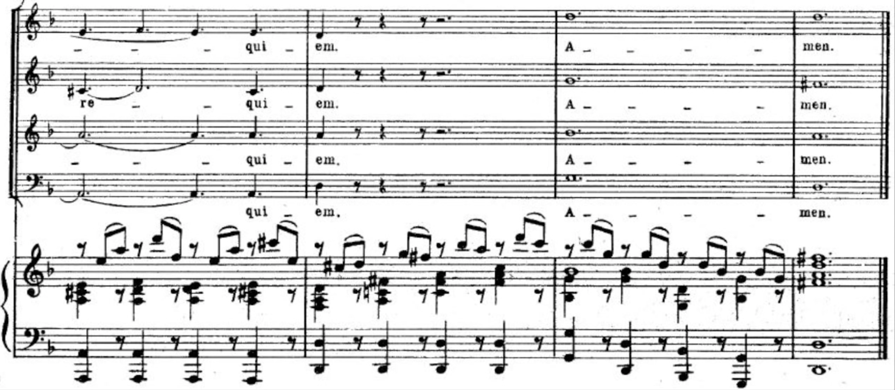

[category]: <> (General)
[date]: <> (2021/07/24)
[title]: <> (Symphonies and Scatology: Mozart At His Most Feral)

Wolfgang. Amadeus. Mozart. 

What a name. What a guy! Perhaps the greatest composer of all time, this immature little wretch is responsible for a torrential stream of composition, which (along with Johann Sebastian) forms nothing less than the foundation of Western Music.

Despite living half as long as the majority of his contemporaries, Mozart was able to match, if not exceed their compositional output. In order to do this, Mozart had to work faster, and more efficiently than the average musical genius of the day. While Mozart's music echoes with the ideals of *Stil Galant* - charmingly elegant, peaceful - there are a select few moments where things go utterly off the rails. Punctuating the perfection, there is an innate urgency - a glimpse into the mind of the tortured genius - a rushing, pulsing mania; a plea against early encroaching death.

**Number 5: Concerto for Piano and Orchestra (d-minor) K.466**

    

**Number 4:**

    

**Number 3: Piano Sonata No. 8 in a-minor K.310**

    

**Number 2:**

    

**Number 1: The Requiem in D minor, K. 626**

This piece is essentially a garguantuan, beserk, fever-dream; it is without a doubt Mozart's most feral composition. Imagine it: one can all but feel the daggers of icy rain as one races through the sleeping streets of 16th-century Salzburg. Hacking into a bloody handkerchief, the vengeful spectre of one's deceased father haunting the mind, one frantically pens the final bars of an unfinished *Requiem*, knowing it will be the soundtrack to one's own funeral. 

I have included a few sections which really pop off, however I might as well have included a pdf of the entire score. 

    

This excerpt from the *Lacrimosa* ("weeping/tearful"), 

    

Literally *Day of Wrath*, this piece 
