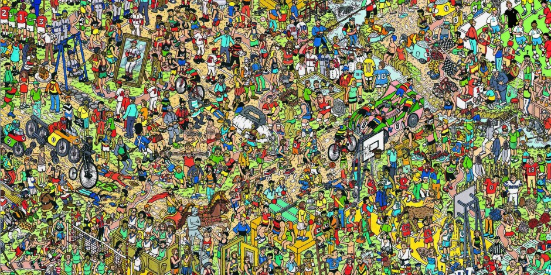
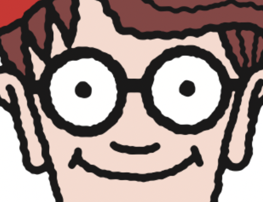
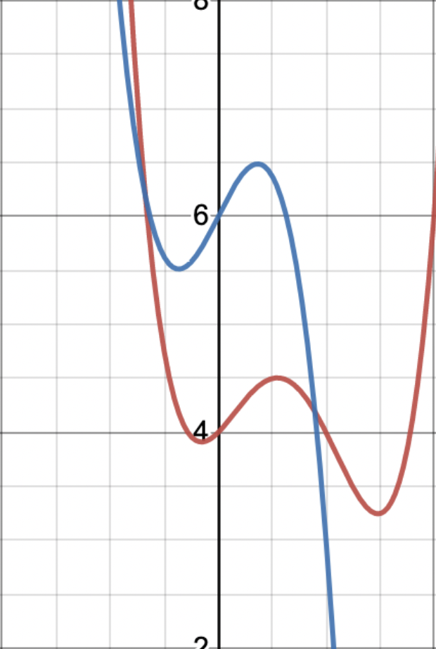

[category]: <> (Computer Science)
[date]: <> (2021/07/07)
[title]: <> (zk-SNARKs: A 30,000 Foot View)

### Introduction
zk-SNARKs, or **Z**ero-**K**nowledge **S**uccict **N**on-interactive **AR**guments of **K**nowledge are a complicated, yet powerful form of mathematical proof. In practice, they are used as a type of trustless communication: prove to me that you know something without revealing the details of what you know. 

There are a number of words in the acronym, and so let's take a quick look at them each individually.

- Zero-Knowledge: this basically means that one party (the prover) can prove to another (the verifier) that a statement is true, without revealing any information beyond the validity of the statement itself.
- Succinct: essentially "efficient" - the proof is concise, and does not grow with the complexity of the thing to be proven.
- Non-interactive: There is no need for back-and forth communication. The proof consists of a single message sent from prover to verifier. 
- Argument of Knowledge: a set of statements (preferably in formal language) used to convince someone of something, or provide support to a claim.
  
### Example
The classic example of a zk-SNARK can be explained using the Where's Wally franchise. ('Where's WaLdO' in some dubious circles.)

    

    *Can you find him? (Clue: he looks like what you would get if you combined santa, a prison inmate, and a pedophile. Very distinctive.)*

This original task of finding Wally is not particularly difficult for human beings. In fact, researchers have created an AI which can find Wally [immediately](https://www.popularmechanics.com/technology/robots/a22705240/this-ai-powered-robot-can-find-waldo-instantly/).

The question asked by zk-SNARKS, however, is profoundly more complex - "can we prove (to a verifier) that we know where Wally is without revealing his actual position?" Before reading further, have a think about how you might do this in practice (you won't).

Metaphorically, this is how it is done. Set up a floor to ceiling wall between the prover (us) and the person to which we are proving our positional knowledge of Mr. Wally. Cut a tiny rectangle in the wall, just large enough to show the elusive character's smug (yet uniquely distinguishable) facial features. Next, add a sheet of one way glass so that the verifier can see whatever the prover positions on one side of the cutout, but the prover cannot see the verifier in any way. Finally, position the map such that Wally's face peeks through the hole, but nothing else about his surroundings is revealed. It is important to note that in this scenario, the viewer (the person we are proving our knowledge to) has absolutely no frame of reference which could be used to figure out where Wally is from our demonstration. In addition, there is no way for the prover and verifier to communicate with each other.

    

    *The simple (yet terrifying) POW (Proof Of Wally) as seen by the verifier.*

This, at an extremely generalized, metaphorical level, is a zero-knowledge proof: or more specifically, a zk-SNARK. While I am still figuring out the trade-offs between the different species of the zk family, (for example, there is another type called ZK-STARKs (Zero-Knowledge Scalable Transparent ARguments of Knowledge) which claims to improve on the technology behind zk-SNARKs) the core idea remains incredibly powerful. 

### Real-World Examples
Originally, zk-SNARKs were used for very niche proofs in computer science, however, they have since been expanded to encompass abstract arguments, and have in fact been shown to summarize ANY form of argument. For example, using zk-SNARKs, we are able to prove that we have a checking account balance larger than $100,000 without revealing the balance itself. We would be able to prove that we have a disability, and qualify for grants, without revealing anything about the nature of that disability. It is important for you, reader, to understand the zk-SNARKs reveal absolutely nothing about the statement in question: only that is is valid or not. These implementation of the use-cases mentioned are still relatively far out, as they deal with the incredibly sensitive details of human society. Much work will need to be done before zk-SNARKs could fully remove the cost of trust.

However, this does not mean that fascinating near-term applications of zk-SNARKs do not abound. For example, zk-SNARKS can be used as proofs of computation. Vitalik Buterin (our king) gave a simple [example](https://vitalik.ca/general/2021/01/26/snarks.html) of a hash function in his article on the topic. For you noobs who don't know what a hash function is, don't worry; no one really knows the details of state of the art hash functions, else they would cease to be true hash functions. For the sake of space, a hash function is simply a mechanism which scrambles a piece of data beyond recognition, such that there is no way (in theory) to figure out how to find the original data from the scrambled version of it.

Eg: if we started with the phrase: "I love her lack of energy! Go girl give us nothing" and hashed it, we would probably get something to the effect of "n283otc4j17934tnc13o47bc1r38n4o". If you saw that key-mash right there, there is very little chance that you would be able to figure out that it was derived from the phrase "I love her lack of energy! Go girl give us nothing". 

This is the essence of hashing. For you math-nerds, a hash function is a *one-way function* - something which actually has yet to be proven to exist. Hash and one-way functions are based on the myth of randomness, which probably does not exist in pure form either (yes, you guessed it, this basically means you have no free will).

Anyway, I'm getting sidetracked. As I said, a modern application of zk-SNARKs can be found in proof-of-computation. Say we take the quintessential "I love her lack of energy! Go girl give us nothing", and hash it one quadrillion times - taking a hash of each previous hash. This is a huge amount of work, even for modern supercomputers. Our final output would be something like "n5c283hsminug2i7345tl2xjo35", and this garbled string could be offered as a form of proof of computation by us to the verifier of the computation. However, this presents a problem: how does the verifier prove that the one quadrillion hashes have been performed without having to re-do the massive amount of computation themselves? How can they prove something with less effort than it took to calculate it? 

For most mathematical problems, this problem of proof is easy. Say we have a function:
$$
x^{45} + 49x^{32} + x^{21} + 1 = 978751264
$$We, the prover, claim to have a solution to it in the form $x_1$ (if you really want to know, it's $x_1≈1.57989$). In order to support our claim, we could simply hand our solution to the verifier for testing. The verifier could plug this number $x_1$ into the equation, and check that Right-Hand-Side equals Left-Hand-Side. Done! It would be vastly inefficient for the verifier to check the proof by finding the real root through attempting to re-calculate it / replicate the process of the prover.

At first glance, extending this simple math example to hash-functions or other, more abstract proofs such as the proof of disability mentioned earlier might seem tricky, or nigh-impossible. Fear not, however, for zk-SNARKs save the day.

### How ZKSnarks work (generally)
Spoiler Alert: I am in no way going to go into the specifics of how zk-SNARKs function under the hood. The full details of the math is quite literally beyond me at this stage. What I will provide, however, is a 30,000 foot view of their functionality: what they do, not how they do it.

Abstracting naively from the sparse amount of reading and research I have done on the subject, zk-SNARKs start by encoding computations as polynomials. As it turns out, all computations can be reduced to very simple steps - addition, multiplication, and the like, regardless of their complexity, and so, in theory, all computations can be encoded as polynomials.

Once in polynomial form, the creator of the zk-SNARK (or prover) aims to provide a proof in the form of a solution (or root) of the polynomial they have encoded. That is, given a large, complicated encoding of a computation - in the form $y = f(x)$ (or to be more mathematically precise: $y_1, y_2, y_3... = f(x_1, x_2, x_3 ...)$), we provide a proof that we have solved that problem, or completed the computation, in the form of a solution $(x_1, x_2, x_3 ...), (y_1, y_2, y_3...)$ to the polynomial. Put another way, we provide the inputs to the polynomial, and the outputs they yield.

Once the verifier is able to see the inputs and outputs to our polynomial, they should be able to compare that to their own computation, or encoding of the polynomial. If they match, the verifier can be confident that the prover has the same polynomial, hence, has completed the same computation. 

Now, why does this work? Essentially, we are able to verify solutions to polynomial equations very quickly because polynomial functions are, in simple language, very uniquely squigily. That is, given two abitrary polynomials, even of the same degree, the chance of them intersecting at a randomly chosen point is incredibly low. 

    

    *Note that these polynomials only intersect at a two points out of all possible points. Guessing the intersection points without any information about the polynomials would be extremely difficult.*

Why is this property helpful? Well, it implies that if two polynomials, evaluated at a random point are equal, there is a very very high chance that they are in fact the same polynomial. This concept is more formally explained by the [Schwartz–Zippel lemma] (https://en.wikipedia.org/wiki/Schwartz–Zippel_lemma). 

Understanding these properties, the procedure of the zk-SNARK is relatively simple. Instead of having the prover hand over their computation in polynomial form, and having the verifier compare this to their own, the parties perform the following steps:

  - The prover selects a set of random numbers, and evaluates their polynomial at that random point. They then give the same random numbers, as well as the value of their polynomial at that random point to the verifier. 
  - The verifier calculates the value of their polynomial at that random point, and if their value matches the provers value, they will be able to infer (with a high level of certainty) that the prover's computation is the same as (or at least fulfils all the necessary criteria of) the verifiers own computation.

This process forms the backbone of the trustless, succinct, and one-way argument mentioned above. If the proof is to be truly non-interactive, the prover will not receive any information as to whether their proof convinced the verifier or not.

### To recap:

1. In theory, it is possible to encode any arbitrary computation as a polynomial. This is because polynomials can represent a lot of information in a single, compact equation.
2. Once in polynomial form, a polynomial-erized computation can be compared to another polynomial-erized computation.
3. Without sharing the polynomials themselves, it is possible to convince a verifier (with a high level of confidence) that two polynomials are the same (or similar) by evaluating them at a random point, and comparing the outputs.

As stated in the title, this article is an incredibly high level overview of the basics behind zk-SNARKs. There certainly is a lot more going on underneath the hood. In practice, there are many small tricks, such as polynomial hashes, elliptic curve pairings, verkle trees, and many other difficult math concepts which are used to make this technology more secure. I encourage you to read more on them - it might be frustrating at first but the best way to learn something is to immerse yourself in the topic. 

Thank you for reading. Please reach out to me at jstapleton17@apu.edu for any further questions or corrections to what I said here.
